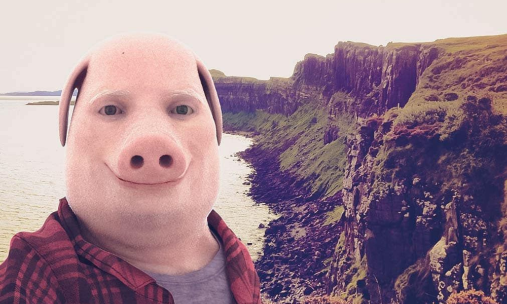
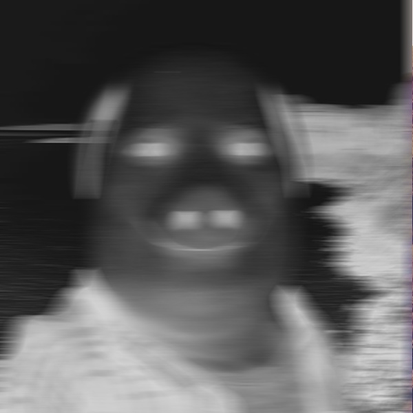

# Bmp Processor 🖼️

Консольное приложение для обработки 24-битных изображений без таблицы цветов в формате BMP с поддержкой различных фильтров.

[](https://cmake.org)

## Возможности ✨

### Базовые фильтры:
- **Обрезка** `-crop width height`  
  Пример: `-crop 800 600`
  
- **Оттенки серого** `-gs`  
  Пример: `-gs`

- **Негатив** `-neg`  
  Пример: `-neg`

- **Резкость** `-sharp`  
  Пример: `-sharp`

- **Выделение границ** `-edge threshold`  
  Пример: `-edge 0.7`

- **Размытие Гаусса** `-blur sigma`  
  Пример: `-blur 10`

### Дополнительный фильтр:
- **Motion Blur** `-motion size angle`  
  Имитация движения (размытие по направлению)  
  Пример: `-motion 20 0`

## Установка 🛠️

### Сборка проекта:
```bash
mkdir build && cd build
cmake ..
cmake --build .
./bmp_processor 
```


### Запуск тестов:
```bash
cd test_script
python3 test_image_processor.py
```

## Использование 🚀

### Базовый синтаксис:
```bash
./bmp_processor <input.bmp> <output.bmp> [фильтры...]
```

### Пример:
```bash
./bmp_processor input.bmp result.bmp -crop 800 600 -gs -motion 15 45 -blur 5
```

## Структура проекта 📂
```
.
├── include/             # Заголовочные файлы
│   ├── filters/         # Реализация фильтров
│   ├── io/              # Ввод-вывод BMP
│   └── utility/         # Вспомогательные классы
├── src/                 # Исходный код
├── assets/              # Примеры изображений
├── test_script/         # Тесты и проверочные данные
└── CMakeLists.txt       # Конфигурация сборки
```

## Примеры обработки 🎨

| Исходное изображение | Результат |
|----------------------|-----------|
|  |  |

```bash
./bmp_processor "assets/John.bmp" "assets/result/res.bmp" -crop 600 600 -neg -gs -motion 40 0
```

## Технические детали ⚙️
- Не использует дополнительных библиотек
- Поддержка 24-битных BMP файлов
- Обработка граничных пикселей
- Оптимизированные алгоритмы свертки
- Обработка ошибок
- Поддержка многократного применения фильтров

## Оптимизации алгоритмов свёртки ⚡

Фильтры размытия по Гаусу и размытии в движении реализованы с использованием **сепарабельной свёртки** для существенного ускорения вычислений.

**Разложение ядра**  
   Двумерная матрица заменена на два одномерных ядра (горизонтальное и вертикальное):
   ```math
   G(x,y) = G(x) \cdot G(y)
   ```
   Сложность: O(N²) → O(2N)


---

**Лицензия**: [MIT](LICENSE.txt) | 2025 | Image Processing Course Project
